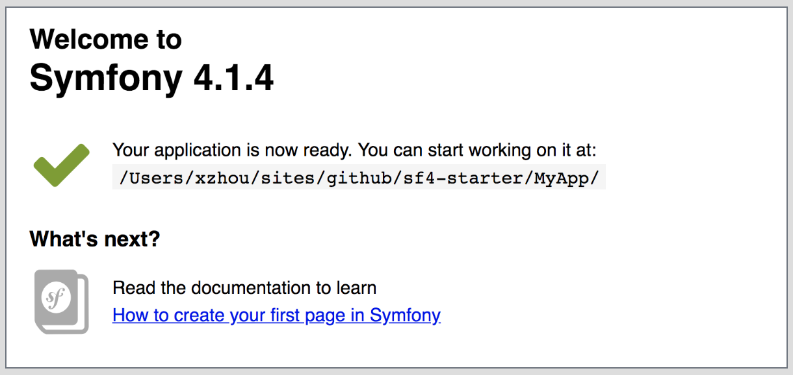

# My minimized Symfony 4 starter kit


Quickstart with `Symfony 4` and my favorite development tools, such as `php-cs-fixer`, `phpstan`, `behat`.

## 1. Init Project
```
bash init.sh <project_name>
```

## 2. Start Project
```
cd MyApp
bin/console server:run
```
then open URL `http://127.0.0.8000` in browser, the symfony start page should be shown.

> if port 8000 is already used for local environment. The port might be changed to `8001`.





## 3. Useful commands
phpunit tests
```
bin/phpunit
```

format the code
```
vendor/bin/php-cs-fixer fix
```

detect the code error
```
vendor/bin/phpstan analyse src/
```

## 4. Customize composer scripts
add the following definitions to composer.json `scripts` node.
```
    "scripts": {
        "test": "bin/phpunit tests/", 
        "stan": "vendor/bin/phpstan analyse src/", 
        "fix": "vendor/bin/php-cs-fixer fix",
    }

```

then call the commands:
```
composer test
composer stan
composer fix
```